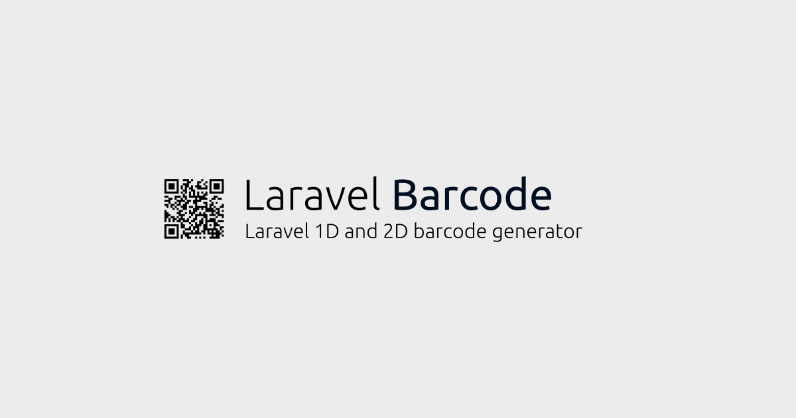

<div align="center">
	<p></p>   
    <a href="#requirements">Requirements</a> |    
    <a href="#installation">Installation</a> |    
    <a href="#supported-symbologies">Supported Symbologies</a>
</div>

------

# Laravel Barcode

## Introduction

Laravel Barcode is a wrapper for the TCPDF barcode functions and was built exclusively for the [Laravel](https://laravel.com) platform.
This project supports 31 symbologies for 1D barcodes and 3 symbologies for 2D barcodes 

## Requirements

- PHP >= 8.0
- Laravel >= 8.6.6

## Installation

Installation is pretty easy. 

First you install the package

```bash
composer require jorgenwdm/laravel-barcode
```

Then you can publish the configuration file of this package (at the moment this is empty). 

```php
php artisan vendor:publish --provider="Jorgenwdm\Barcode\BarcodeServiceProvider"
```

Note: Our configuration file is `laravel-barcode.php` and you will find it in your Laravel `config` folder.

And we are ready to go!

## Some important notes

Every barcode 1D or 2D consists of elements. 1D barcode consists of lines and 2D barcode of rectangles.
When we set the size of a barcode, we set the size of each element (not the size of the whole barcode).

Also, when we set the color, this is the color for each element of the barcode. 
The background of the barcode is always transparent.


## Supported Symbologies

| Category | Type | Description |
| :---: | :---- | :---- |
| 1D | C39 | CODE 39 - ANSI MH10.8M-1983 - USD-3 - 3 of 9. 
| 1D | C39+ | CODE 39 with checksum 
| 1D | C39E | CODE 39 EXTENDED 
| 1D | C39E+ | CODE 39 EXTENDED + CHECKSUM 
| 1D | C93 | CODE 93 - USS-93 
| 1D | S25 | Standard 2 of 5 
| 1D | S25+ | Standard 2 of 5 + CHECKSUM 
| 1D | I25 | Interleaved 2 of 5 
| 1D | I25+ | Interleaved 2 of 5 + CHECKSUM 
| 1D | C128 | CODE 128 
| 1D | C128A | CODE 128 A 
| 1D | C128B | CODE 128 B 
| 1D | C128C | CODE 128 C 
| 1D | EAN2 | 2-Digits UPC-Based Extension 
| 1D | EAN5 | 5-Digits UPC-Based Extension 
| 1D | EAN8 | EAN 8 
| 1D | EAN13 | EAN 13 
| 1D | UPCA | UPC-A 
| 1D | UPCE | UPC-E 
| 1D | MSI | MSI (Variation of Plessey code) 
| 1D | MSI+ | MSI + CHECKSUM (modulo 11) 
| 1D | POSTNET | POSTNET 
| 1D | PLANET | PLANET 
| 1D | RMS4CC | RMS4CC (Royal Mail 4-state Customer Code) - CBC (Customer Bar Code)
| 1D | KIX | KIX (Klant index - Customer index) 
| 1D | IMB | IMB - Intelligent Mail Barcode - Onecode - USPS-B-3200 
| 1D | IMBPRE | IMB - Intelligent Mail Barcode - Onecode - USPS-B-3200- pre-processed 
| 1D | CODABAR | CODABAR 
| 1D | CODE11 | CODE 11 
| 1D | PHARMA | PHARMACODE 
| 1D | PHARMA2T | PHARMACODE TWO-TRACKS
| 2D | DATAMATRIX | DataMatrix ECC 200
| 2D | QRCODE | QR Code
| 2D | PDF147 | PDF417 (ISO/IEC 15438:2006)


## How to create a 1D barcode

The way to create a barcode with the default settings is very simple. 

There are four output methods supported: `toHtml()`, `toSvgCode()`, `toPng()`, `toSvg()`.

Examples:

```php    
    use Jorgenwdm\Barcode\Generators\Barcode1d;

    echo Barcode1d::create("C39", "12345678")->toHtml();    

```

```php    
    use Jorgenwdm\Barcode\Generators\Barcode1d;
    
    echo "<svg height=174 width=174>";
    echo Barcode1d::create("C39", "12345678")->toSvgCode();
    echo "</svg>";

```

```php    
    use Jorgenwdm\Barcode\Generators\Barcode1d;

    $content = Barcode1d::create("C39", "12345678")->toPng();
    
    return response($content)->header('Content-Type', 'image/png');

```

```php    
    use Jorgenwdm\Barcode\Generators\Barcode1d;

    $content = Barcode1d::create("C39", "12345678")->toSvg();
    
    return response($content)->header('Content-Type', 'image/svg+xml');

```

Additionally there are helping methods to customize the final barcode to be rendered.

These are `size($width, $height)`, `color($hexColor)`.

```php    
    use Jorgenwdm\Barcode\Generators\Barcode1d;
    
    // We will create a C39 barcode where each line width is 2px and height is 30px
    // The color of the barcode will be #000000 (that is black)
    echo Barcode1d::create("C39", "12345678")->size(2,30)->color("#000000")->toHtml();

```

## How to create a 2D barcode

The way to create a barcode with the default settings is very simple. 

There are four output methods supported: `toHtml()`, `toSvgCode()`, `toPng()`, `toSvg()`.

Examples:

```php    
    use Jorgenwdm\Barcode\Generators\Barcode2d;

    echo Barcode2d::create("DATAMATRIX", "http://www.test.com/")->toHtml();    

```

```php    
    use Jorgenwdm\Barcode\Generators\Barcode2d;
    
    echo "<svg height=174 width=174>";
    echo Barcode2d::create("QRCODE", "http://www.test.com/")->toSvgCode();
    echo "</svg>";

```

```php    
    use Jorgenwdm\Barcode\Generators\Barcode2d;

    $content = Barcode2d::create("DATAMATRIX", "http://www.test.com/")->toPng();
    
    return response($content)->header('Content-Type', 'image/png');

```

```php    
    use Jorgenwdm\Barcode\Generators\Barcode2d;

    $content = Barcode2d::create("QRCODE", "http://www.test.com/")->toSvg();
    
    return response($content)->header('Content-Type', 'image/svg+xml');

```

Additionally there are helping methods to customize the final barcode to be rendered.

These are `size($width, $height)`, `color($hexColor)`.

```php    
    use Jorgenwdm\Barcode\Generators\Barcode2d;
    
    // We will create a DATAMATRIX barcode where 
    // each small rectangle of the barcode has width 6px and height 6px
    // The color of the barcode will be #000000 (that is black)
    echo Barcode2d::create("DATAMATRIX", "http://www.in.gr/")->size(6,6)->color("#000000")->toHtml();

```

## Helper function

We have also created a helper function that wraps all the basic functionalities of the barcode generators.
This function is auto-loaded as soon as you install this package and you can use it globally in your project.

Tha basic syntax is 

```php
create_barcode($barcodeCategory, $barcodeType, $barcodeText, $width, $height, $hexColor, $output);

```

| Argument | Description | Values |
| :---- | :---- | :---- |
| $barcodeCategory | The category of the barcode | 1D, 2D |
| $barcodeType | The type of the barcode | C39, C39+, ... |
| $barcodeText | The text for the barcode | [string] |
| $width | The width of each element that the barcode consists of | [integer] |
| $height | The height of each element that the barcode consists of | [integer] |
| $hexColor | The color of each element that the barcode consists of | [string hex color] |
| $output | The output format of the barcode | HTML, SVG, PNG, SVGCODE |

Example:

```php    

    echo create_barcode("1D", "C39", "GEORGE", 5, 30, "#000000", "HTML");

```


## License

This project is open-sourced software licensed under the [MIT license](https://opensource.org/licenses/MIT).
